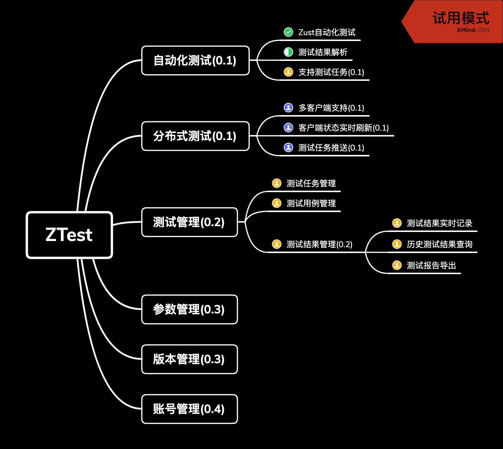

# 寒假练习项目

## 目标

通过项目开发, 来学习一个**完整**的项目的开发过程.

## 环境

- visual studio 2019
- github账号

## Day 1 准备环境

### 安装visual studio 2019 企业版

下载地址: https://visualstudio.microsoft.com/zh-hans/vs/

### 注册github账号

https://github.com/

本次我们不使用fork, 而是使用"协作开发"的方式. 所以需要把注册的用户名添加到contributor中, 直接可以合并.

### 学习git命令

网上有很多关于git和github的教程可以学习

b站上的教程: https://www.bilibili.com/video/av10475153

git命令的思维导图: https://www.processon.com/view/link/5c6e2755e4b03334b523ffc3

我们这次必须掌握的是add, delete, commit等常用的命令

### 在vs 2019中使用git

visual studio默认是安装了git和github插件的.

过程比较简单, 基本就是一步步来的, 本次我们不使用fork, 而是使用"协作开发"的方式.

### 练习

1. 注册github账号, 并创建自己的第一个项目
2. 文件的添加与修改
   - 使用网页版修改
   - 使用vs的github插件修改文件
   - 使用git bash的方式clone文件, 修改和提交
3. branch
   - 创建branch, 命名为dev
   - 在dev上进行一些修改, 并且合并到master
   - 创建branch, 命名为feature
   - 在feature和dev上分别修改, 并且合并到master

3. fork
   - fork https://github.com/lus-test/github-cmd-test.git 项目
   - 在自己的分支上进行修改
   - 新增一个pull request
   - 由于已经添加了contributor, 所以可以merge并合并代码

## Day 2 需求分析

在软件工程中, 我们已经学习到了常见的开发模型, 这次我们用**瀑布模型**来进行开发. 这个模型的特点是按照阶段, 为开发设置了**检查点** , 即每个过程都会有输出(文档), 并且是下一个阶段的输入.

按照一个标准流程, 我们也会分为

| 阶段名   | 工作内容                 | 测试     |
| -------- | ------------------------ | -------- |
| 需求建模 | 分析需求, 并且对需求建模 | 验收测试 |
| 基本设计 | 体系结构设计             | 系统测试 |
| 详细设计 |                          | 系统测试 |
| 编码     |                          | 单元测试 |

因为这次**没有特别明确的需求**, 所以我们其实做的是**基于现有的自动化测试, 设计一个管理工具**

所以包括:

- 测试用例和数据的管理
- 测试包版本管理
- 分布式的自动化测试
- 可视化的测试结果分析

所以我们要基于此, 进行一个**需求分析**, 并且在此基础上进行**工作量**和**工作计划**的指定

### 需求分析过程

首先, 我们邀请了测试人员(需求提出者)和开发人员都参与了本次的需求会, 进行头脑风暴, 在会议中实际上想到了很多内容, 包括分布式推送, 计划自动生成等等. 但是最终确认目前的最大痛点**单次测试需要花费的时间太久(接近5小时)**, 所以0.1版本的首要目标, 就是解决这个问题, 次要的痛点是**测试结果/用例的版本管理混乱**, 特别是历史版本, 无法确定应该使用什么测试用例, 所以0.2版本要解决该问题.

### 技术选型

参与此次的开发人员的技术栈, 分别为C++和C#, 所以我们不同的模块采用了不同的语言. 

由于测试软件不支持在单主机上进行并发运行, 而测试项之间无关联性, 所以通过**分布式**来解决单次时间太久的问题, 确定使用**C/S架构**来进行并发运行. 由于本项目不需要高并发连接, 所以使用C#进行开发, 提高开发效率.

在测试管理上, 使用数据库进行数据存储, 并提供记录查询等功能, 为了方便部署和轻量化, 所以使用**sqlite**作为存储, 相关模块使用C++开发.

### 规格文档

文档方面我们参考了这篇文章: https://www.jianshu.com/p/a52fe78962f0

[软件需求,概要设计,详细设计文档怎么做,做什么](reference/软件需求，概要设计，详细设计（文档）怎么做，做什么？ - 简书.pdf)

### Roadmap

在进行需求分析的过程中, 发现了一个问题, 大家会将各种功能都混杂在一起, 比如说Server提供了GUI, 提供了任务管理, 所以我们对功能重新进行了解耦, 并且规划到了不同版本中.

## Day3 基本设计

## Day4 详细设计

## Day5 编码

## Day6 测试

## Day7 验收

