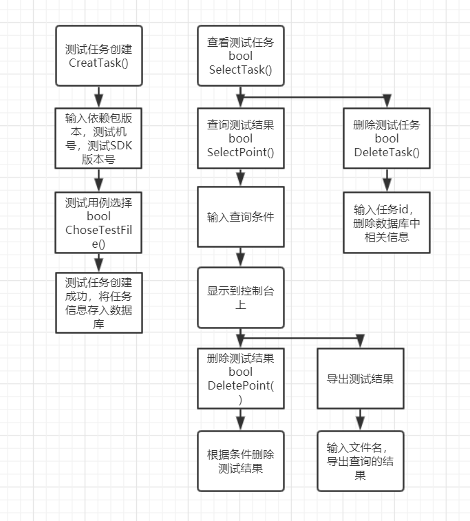

## 1总述

对于自动化测试，需要提供管理功能：测试任务管理，测试用例管理，测试结果管理。平台为windows，开发环境为vs2019。

测试任务管理仅仅为一个输入入口，测试用例管理需要读取测试用例文件，供用户选择，测试结果管理提供了测试结果的查询和导出功能。

## 2总体设计



## 3外部接口

### 3.1测试任务管理和测试用例管理

类1 Task：

```
public:

int m_nTaskID;			//测试任务ID

string m_sStartTime;	//测试开始时间

int m_nCilent;			//测试分配机器号

vector<string> m_sdependences;	//依赖包版本号

string m_sTestSDK;		//测试包版本号

bool CreatTask();		//创建测试任务

bool ChoseTestFile();	//选择测试用例文件

bool SelectTask();		//查看测试任务

bool DeleteTask();		//删除测试任务
```


### 3.2测试结果管理

类2 Point：

```
public:

string m_sFileName;		//要导出的文件名

bool m_bFlag			//point结果，用以查询测试结果条件

bool SelectPoint();		//查询point结果

bool DeletePoint();		//删除point结果

bool DetiveTaskResult();//导出测试结果
```


## 4模块设计

### 4.2测试用例管理模块

用一个文本文档来存储测试包SDK中含有的测试文件，供用户选择测试任务需要运行的测试用例

### 4.3测试结果管理模块

使用SQLite数据库存储测试结果

#### 数据库表结构

表1【测试任务总表】

| id   | 日期 | 版本 | 错误总数 | 正确总数 | 状态（运行中/已结束） | 客户端 |      |      |      |
| ---- | ---- | ---- | -------- | -------- | --------------------- | ------ | ---- | ---- | ---- |
|      |      |      |          |          |                       |        |      |      |      |

表2【测试用例总表】

| id   | 文件名 | （外键）测试任务id |      |      |      |      |      |      |      |
| ---- | ------ | ------------------ | ---- | ---- | ---- | ---- | ---- | ---- | ---- |
|      |        |                    |      |      |      |      |      |      |      |

表2【point表】

| id   | 内容 | 是否正确（OK） | 错误句子 | （外键）所属文件id | （外键）测试任务id |      |      |      |
| ---- | ---- | -------------- | -------- | ------------------ | ------------------ | ---- | ---- | ---- |
|      |      |                |          |                    |                    |      |      |      |

