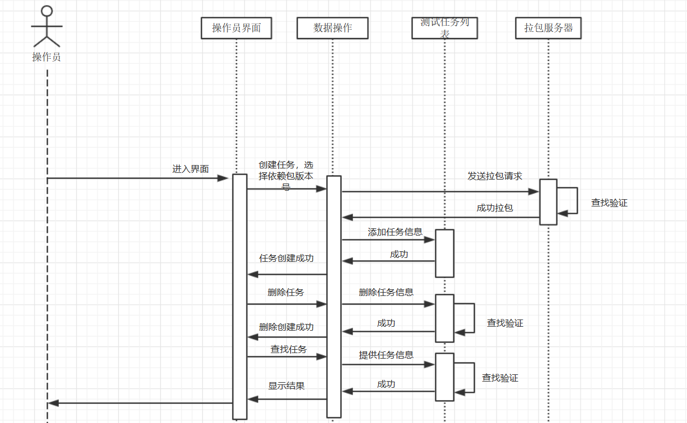
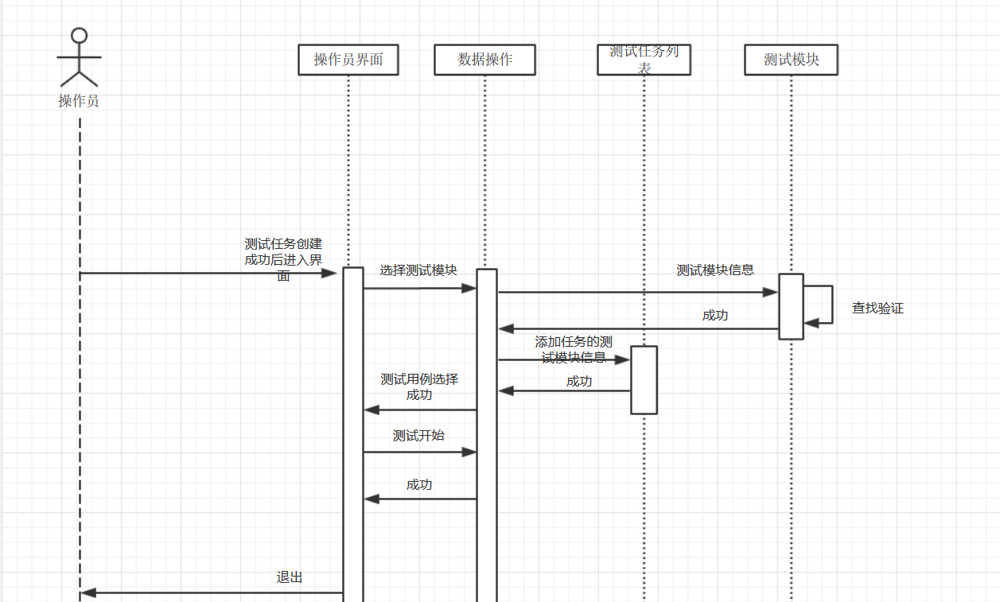
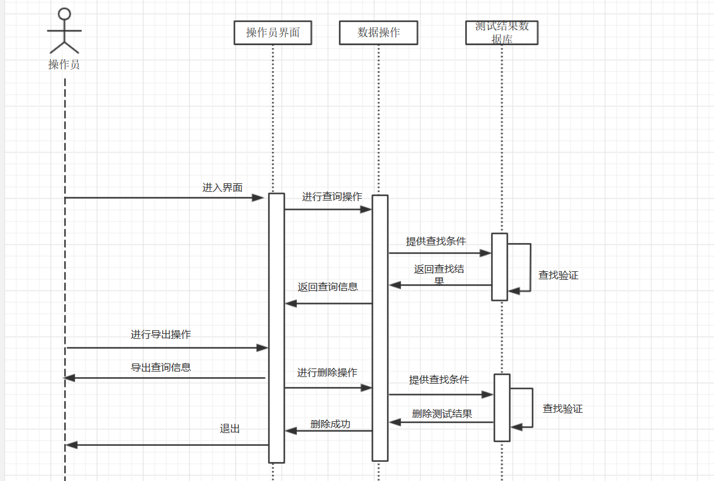

# 测试管理需求规格说明书

# 1概述

## 1.1目的

测试任务管理与测试用例管理是为了能够对自动化测试任务和任务需要运行的脚本进行管理，方便自动化脚本的运行，减少冗余的测试点，保证测试到位的同时方便发布；

测试结果管理则方便使用者去查看，查询测试结果，便于找到未能通过的测试点及原因。

## 1.2术语与定义

* 测试任务：设置好依赖包版本号，测试用例的一次自动化测试
* 测试用例：一个测试用例即是一个point，测试结果可能是FAILED（不通过）或者OK（通过）
* 测试结果：自动化测试的结果
* 拉包服务器：软件各个模块的包所在的服务器

# 2项目的标准与规范

代码符合维宏公司编码规范

# 3运行环境规定

1. windows 系统
2. 要有 SQLite 数据库并提供数据库初始数据
3. 能够访问拉包服务器

# 4功能规格

## 4.1测试任务管理

### 4.1.1结构图

### 4.1.2具体功能

- 创建自动化测试任务，包括选择依赖包的版本，测试用例的版本
- 删除任务
- 查询任务

### 4.1.3界面

#### 界面1

* 选择创建任务，转向界面2
* 选择查询任务，转向界面3

#### 界面2

* 选择依赖包的版本号
* 选择测试用例的版本号
* 选择要分配的客户端
* 确认，转向测试用例管理的界面4

#### 界面3（显示测试任务的编号，时间，备注）

* 可以选择某个测试任务，转向测试结果管理的界面5
* 可以选择删除某个测试任务，仍在界面3

## 4.2测试用例管理

### 4.2.1结构图

### 4.2.2具体功能

* 选择测试用例
* 开始自动化测

### 4.2.3界面

#### 界面4（创建任务时选择依赖包版本号后进入）

* 选择相应SDK的测试用例文件，开始自动化测试

## 4.3测试结果管理

后处理工具，方便对测试结果进行管理

### 4.3.1结构图：

### 4.3.2具体功能

1. 能够提供查询功能，可以查询某次测试结果的FAILED或者OK的point，并能看到错误原因
2. 能够单独将某一次测试结果的FAILED或OK的point导出，需要提供导出文件名

### 4.3.3界面

#### 界面5（由界面1查询任务转入）

* 可以选择显示全部测试点结果，转向界面6
* 可以选择显示错误的测试点结果，转向界面6
* 可以选择导出测试结果，需要输入文件名

#### 界面6

显示测试点结果

# 5非功能规格

查找性能受到测试点数目影响